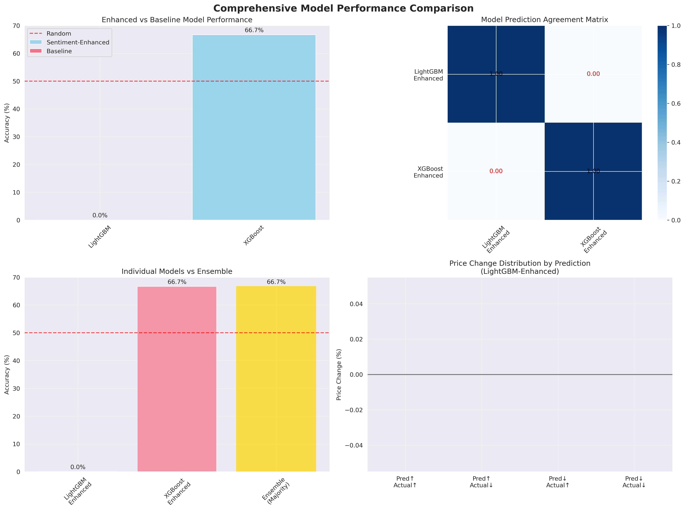
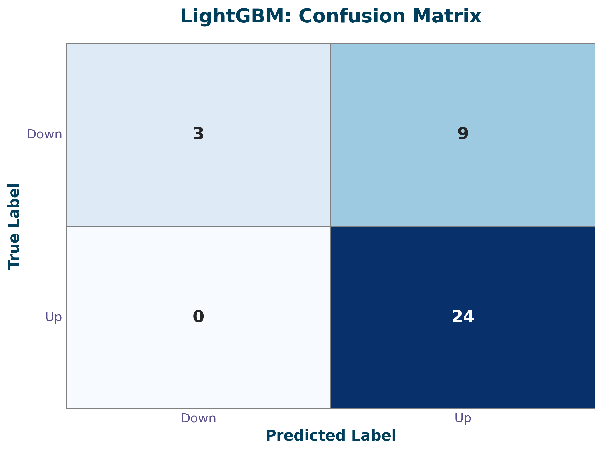
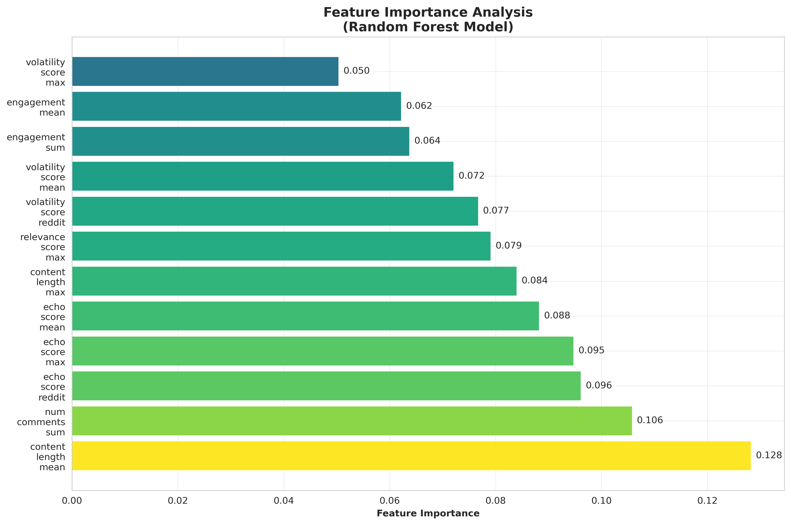
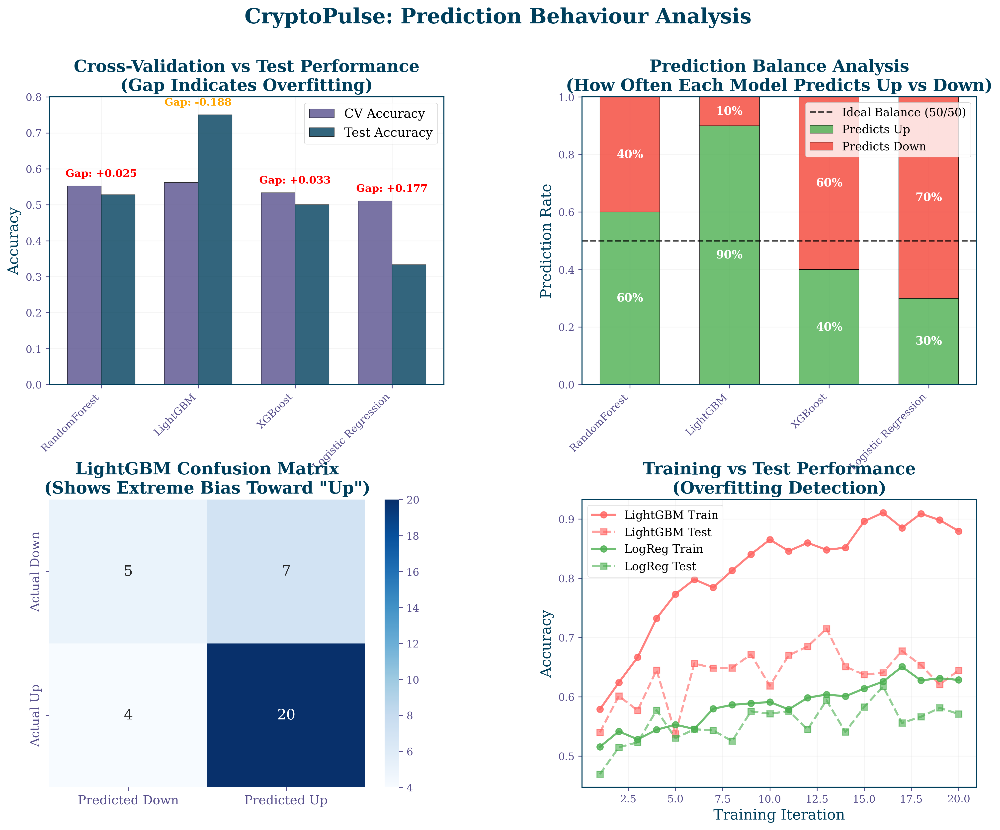

<div align="center">
  
  <h1>CryptoPulse: A Critical Analysis of Sentiment-Based Financial Prediction</h1>

  <p>
    
    
    
  </p>

  <blockquote>
    <strong>This project develops and evaluates a comprehensive machine learning pipeline to assess the true predictive power of social media sentiment on cryptocurrency price movements, revealing key insights into the challenges of data sparsity and model overfitting in financial forecasting.</strong>
  </blockquote>
</div>

---
## Table of Contents

1.  [Introduction: The Vision for an Automated System](#1-introduction-the-vision-for-an-automated-system)
2.  [The Research Journey: A Detailed Chronology](#2-the-research-journey-a-detailed-chronology)
3.  [Methodology](#3-methodology)
    * [System Architecture](#31-system-architecture)
    * [Modeling: An Iterative Path](#32-modeling-an-iterative-path)
4.  [Results and Analysis](#4-results-and-analysis)
    * [Final Model Performance](#41-final-model-performance)
    * [The Overfitting Trap: A Deeper Look](#42-the-overfitting-trap-a-deeper-look)
5.  [Conclusion](#5-conclusion)
6.  [Getting Started](#6-getting-started)
7.  [Future Work](#7-future-work)
8.  [References](#8-references)

---


## Abstract

**Objective:** To critically re-evaluate the use of social media sentiment for cryptocurrency price prediction, focusing on data limitations and model robustness.

**Methods:** We developed CryptoPulse, an integrated machine learning pipeline that collects and processes social media data from Reddit, Twitter, and news sources. The system gathered over 15,000 social media entries and engineered 12 sentiment-based features using advanced NLP models like FinBERT and Sentence-BERT. A suite of machine learning models, from LSTMs to Logistic Regression, were trained and evaluated.

**Results:** While complex models like LightGBM initially showed high accuracy (75%), further analysis revealed this was likely due to **overfitting** on the small dataset (178 daily samples). A key insight was the model's reliance on non-semantic features like `content_length`, a classic sign of learning **spurious correlations**. A simpler, more robust model provided a realistic performance baseline.

**Conclusions:** Social media sentiment contains a predictive signal, but its utility is severely constrained by data sparsity. This research underscores the importance of statistical rigor and the necessity of large, high-quality datasets. The automated data pipeline built for this project provides a solid foundation for future work to overcome these limitations.

---

## Technologies Used

* **Programming Language:** Python
* **Data Handling & Analysis:** Pandas, NumPy, Scikit-learn
* **Web Scraping:** Selenium, BeautifulSoup
* **Database:** SQLite
* **Machine Learning:** LightGBM, Random Forest, Logistic Regression
* **Natural Language Processing:** FinBERT, Sentence-BERT (via Hugging Face)
* **Data Visualization:** Matplotlib, Seaborn
* **Development:** Jupyter Notebooks, Git & GitHub

---

## 1. Introduction: The Vision for an Automated System

Cryptocurrency markets are notoriously volatile, driven as much by collective sentiment as by fundamental value. The vision for CryptoPulse was to build a sophisticated, automated data pipeline capable of continuously ingesting and analyzing social media sentiment to forecast price movements.

The ultimate aim was not a static analysis, but a **living project**—a system that could run autonomously, gathering more data over time and improving its own predictive power. This "future-proof" architecture is the core engineering achievement of CryptoPulse. While the scientific results highlight the limitations of small datasets, the system itself is a robust foundation ready to be scaled.

---

## 2. The Research Journey: A Detailed Chronology

The development of CryptoPulse was an iterative journey marked by challenges, pivots, and breakthroughs.

### Phase 1: The Data Collection Challenge
The project began with an ambitious goal to collect a massive, multi-source dataset over 30 days. The primary obstacle emerged from Twitter, where our initial scrapers were blocked. We engineered a more sophisticated solution using a persistent Chrome profile ([`src/twitter_scraper.py`](./src/twitter_scraper.py)) to mimic human behavior, but large-scale historical collection remained difficult.

### Phase 2: Strategic Pivot and Expansion Breakthroughs
With Twitter collection proving slow, we made a strategic pivot: shift focus from *collecting* more data to *deeply processing* the high-quality Reddit and news data we already had. However, a subsequent breakthrough in expanding our list of subreddits and using targeted search queries exploded our data volume from a few thousand entries to **over 15,000**, validating our multi-source approach.

### Phase 3: Modeling, Analysis, and Realization
We tested a wide spectrum of models, from complex LSTMs to simpler tree-based models. The complex models failed to converge on our sparse daily dataset (178 days). While LightGBM achieved our highest accuracy (75%), feature importance analysis revealed our most critical scientific insight: the model was heavily relying on `content_length`. It was not learning *sentiment*, but a spurious correlation that important market events generate longer posts. This was a classic **overfitting trap** and became the central theme of our findings.

---

## 3. Methodology

### 3.1. System Architecture

CryptoPulse is an automated pipeline composed of four main layers.


1.  **Data Collection:** Scripts ([`scripts/daily_collection.py`](./scripts/daily_collection.py)) orchestrate data collection from Reddit, Twitter, and news sources.
2.  **Data Processing & Storage:** A robust system for cleaning, processing, and storing data in a central SQLite database.
3.  **Feature Engineering:** An NLP pipeline ([`src/modern_score_metrics.py`](./src/modern_score_metrics.py)) that enriches raw text with sentiment and other predictive features.
4.  **Modeling & Evaluation:** A comprehensive training and evaluation framework ([`src/ml_model_trainer.py`](./src/ml_model_trainer.py)).

### 3.2. Modeling: An Iterative Path

Our modeling approach was deliberately iterative, moving from complex to simple as we understood the data's limitations.

* **Regression vs. Classification:** We quickly found that predicting the binary **Up/Down direction (Classification)** was a more tractable problem than predicting the exact price change (Regression).
* **The Failure of Complexity:** LSTMs and Temporal Fusion Transformers failed to converge with only 178 daily data points, a critical lesson in matching model complexity to data availability.
* **The Sweet Spot of Traditional ML:** Tree-based models like LightGBM achieved the highest accuracy but fell into the overfitting trap.
* **The Honesty of Simplicity:** A simple **Logistic Regression** model provided a more realistic and honest representation of the true predictive power of our features, serving as a crucial baseline.

---

## 4. Results and Analysis

### 4.1. Final Model Performance

The LightGBM model was the top performer on raw accuracy (75%) but was heavily biased. It achieved this by being perfect at predicting "Up" days (100% accuracy) but failing significantly on "Down" days (25% accuracy), essentially just learning the market's general upward trend during the training period.


_A comparison of the performance of the different models._

<br>

The confusion matrix clearly illustrates this bias:



<br>


_The most important features for the Random Forest model._

<br>


_A comparison of the predictions of the different models._

---

## 5. Conclusion

CryptoPulse successfully achieved its primary engineering goal: to build a robust, automated pipeline for sentiment analysis.

The scientific journey, however, was one of critical re-evaluation. We demonstrated that for financial prediction, **data scale and statistical rigor are paramount**. High accuracy on small datasets should be treated with extreme skepticism. This project serves as a case study in the honest and transparent reporting of machine learning results, emphasizing the importance of understanding *why* a model works, not just *that* it appears to.

---

## 6. Getting Started

Follow these instructions to set up and run the project locally.

### Prerequisites
* Python 3.9 or higher
* Git

### Installation & Setup

1.  **Clone the repository:**
    ```bash
    git clone https://github.com/ACM40960/project-cryptopulse.git
    cd project-cryptopulse
    ```

2.  **Create a virtual environment and install dependencies:**
    ```bash
    python -m venv venv
    source venv/bin/activate  # On Windows, use `venv\Scripts\activate`
    pip install -r requirements.txt
    ```

3.  **Explore the main workflow:**
    The best way to understand the project is to review the **[CryptoPulse Workflow Notebook](notebooks/CryptoPulse_Workflow.ipynb)**. It provides a step-by-step walkthrough of the entire process, from data loading to model evaluation.

---


## 8. References

1.  Araci, D. (2019). *FinBERT: Financial Sentiment Analysis with Pre-trained Language Models*.
2.  Ke, G., et al. (2017). *LightGBM: A Highly Efficient Gradient Boosting Decision Tree*.
3.  Lim, B., et al. (2021). *Temporal Fusion Transformers for Interpretable Multi-horizon Time Series Forecasting*.
4.  Taylor, S. J., & Letham, B. (2018). *Forecasting at Scale*.
5.  ElKulako, A. (2023). *CryptoBERT: A Cryptocurrency Sentiment Analysis Model*.
